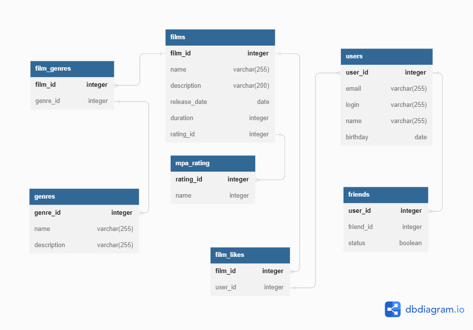

# java-filmorate
Template repository for Filmorate project.
---

<details>
  <summary>Получить фильм с id=1</summary>

```sql
    SELECT *
    FROM films
    WHERE film_id = 1;
```

</details>  

<details>
  <summary>Получить пользователя с id=2</summary>

```sql
    SELECT *
    FROM users
    WHERE user_id = 2;
```

</details>  

<details>
  <summary>Удалить пользователя с id=3</summary>

```sql
    DELETE FROM users
    WHERE user_id = 2;
```

</details>